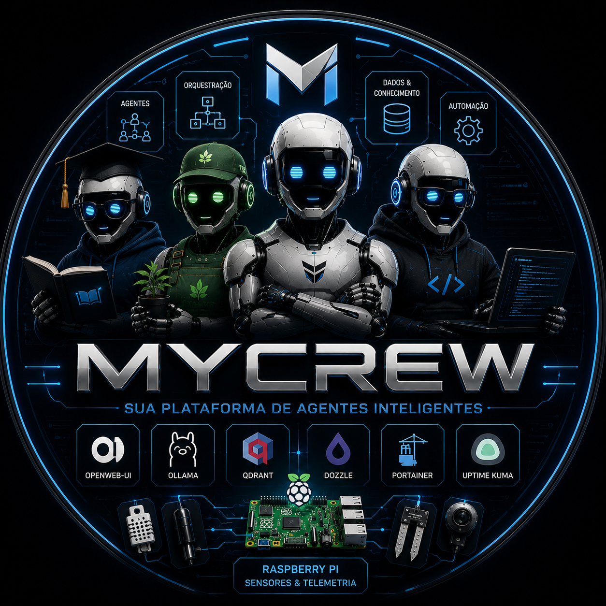

╔══════════════════════════════════════════════════════════════════════════════════════╗
║                                                                                      ║
║      ███╗   ███╗██╗   ██╗ ██████╗██████╗ ███████╗██╗    ██╗   v1.0                   ║
║      ████╗ ████║╚██╗ ██╔╝██╔════╝██╔══██╗██╔════╝██║    ██║   AI PLATFORM            ║
║      ██╔████╔██║ ╚████╔╝ ██║     ██████╔╝█████╗  ██║ █╗ ██║   LOCAL • CLOUD          ║
║      ██║╚██╔╝██║  ╚██╔╝  ██║     ██╔══██╗██╔══╝  ██║███╗██║   MULTI AGENT            ║
║      ██║ ╚═╝ ██║   ██║   ╚██████╗██║  ██║███████╗╚███╔███╔╝   SELF HOSTED            ║
║      ╚═╝     ╚═╝   ╚═╝    ╚═════╝╚═╝  ╚═╝╚══════╝ ╚══╝╚══╝    by Rafael Rodrigues    ║
║                                                                                      ║
╚══════════════════════════════════════════════════════════════════════════════════════╝
```

<p align="center">
  
</p>

# MyCrew AI Local Stack


### Core


### Tools


**Responsavel pelo projeto:** Rafael Rodrigues
[](https://github.com/RafaTrash)
[](https://www.linkedin.com/in/rafaelrrodrigues/)

Arquitetura atual: frontend (Next.js) e backend (FastAPI) separados.

## Componentes

### Core — essenciais (profile `core`)

Sobem com `docker compose --profile core up -d`. Sem eles o MyCrew nao funciona.

-  `ollama`: inferencia local de modelos e geracao de embeddings.
-  `qdrant`: banco vetorial usado como memoria/knowledge base dos agentes.
-  `redis`: cache e fila em memoria para o stack.
-  `n8n`: orquestracao dos fluxos de conversa e ingestao de conhecimento.
-  `postgres`: banco relacional para usuarios, agentes e chats.
-  `backend`: API principal do MyCrew — chat, personas, knowledge e execucao de fluxos n8n.
-  `frontend`: interface web para chat, anexar conhecimento e acionar fluxos.

### Tools — opcionais (profile `tools`)

Sobem com `docker compose --profile tools up -d`. Suporte operacional: observabilidade, gestao e automacao — nao sao necessarios para o MyCrew funcionar.

-  `dozzle`: visualizacao de logs dos containers do stack em tempo real.
-  `portainer`: gestao e monitoramento de containers, volumes e redes Docker.
-  `uptime-kuma`: monitoramento de disponibilidade (uptime) dos servicos do stack.

> Para subir tudo de uma vez: `docker compose --profile core --profile tools up -d`
> Ou defina `COMPOSE_PROFILES=core,tools` no `.env` e use apenas `docker compose up -d`.

## Pre-requisitos

- Docker + Docker Compose.
- **Volumes externos**: alguns volumes sao `external: true` e precisam existir antes do primeiro `up`, senao o Compose falha. Crie antes de subir:

```bash
docker volume create mycrew_ollama_data
docker volume create mycrew_qdrant_data
docker volume create mycrew_n8n_data
docker volume create mycrew_portainer_data
docker volume create mycrew_uptime_kuma_data
docker volume create mycrew_postgres_data
docker volume create mycrew_redis_data
```

- **GPU NVIDIA (opcional)**: Se deseja usar GPU, instale o `nvidia-container-toolkit` e descomente a secao de GPU no servico `ollama` do docker-compose.yml.

## Subir ambiente

```bash
docker compose up -d --build
```

## Guia de introducao

### 1. Baixar modelos no Ollama

O container do Ollama sobe vazio — os modelos precisam ser baixados manualmente via `docker exec`:

```bash
# Modelo de chat principal (exemplo)
docker exec -it mycrew-ollama ollama pull llama3.1:8b

# Modelo de embeddings, usado na retroalimentacao (Qdrant)
docker exec -it mycrew-ollama ollama pull nomic-embed-text

# Modelo de codigo (opcional)
docker exec -it mycrew-ollama ollama pull qwen2.5-coder:7b
```

Confirme o que ja foi baixado:

```bash
docker exec -it mycrew-ollama ollama list
```

> Troque `llama3.1:8b` por qualquer modelo do [catalogo do Ollama](https://ollama.com/library) compativel com sua GPU/VRAM.

### 2. Acessar o n8n e configurar fluxos

1. Acesse `http://localhost:5678`.
2. Faca login com as credenciais definidas no `.env` (`N8N_BASIC_AUTH_USER` / `N8N_BASIC_AUTH_PASSWORD`).
3. Configure os workflows de chat e knowledge conforme necessario.

### 3. Acessar o Frontend

1. Acesse `http://localhost:8081`.
2. O frontend se conecta automaticamente ao backend.

## URLs

- Frontend MyCrew: `http://localhost:8081`
- Backend API (docs): `http://localhost:8082/docs`
- Ollama: `http://localhost:11435`
- Qdrant: `http://localhost:6333`
- n8n: `http://localhost:5678`
- Dozzle (logs): `http://localhost:8085/dozzle`
- Portainer (gestao Docker): `http://localhost:9000` (HTTP) ou `https://localhost:9443` (HTTPS)
- Uptime Kuma (monitoramento): `http://localhost:3002`

> Nota: o Ollama roda na porta `11435` (nao a padrao `11434`) neste stack — ajustar integracoes/scripts externos de acordo.

## Endpoints principais (backend)

- `GET /api/status`: status de servicos, modelos e agentes.
- `GET /api/personas`: lista agentes locais.
- `POST /api/chat`: conversa com recuperacao de contexto do Qdrant.
- `POST /api/knowledge/attach`: anexa conhecimento no Qdrant por agente.
- `GET /api/knowledge/search`: busca conhecimento por agente.
- `POST /api/flows/start`: dispara fluxo no n8n (`chat` ou `knowledge`).
- `GET /api/flows/{flow_id}`: consulta status de execucao do fluxo.
- `GET /api/agent-doc`: retorna arquivo `.md` do agente local.

## Variaveis de ambiente recomendadas

No `.env`, configure:

**Integracao IA / conhecimento**
- `QDRANT_COLLECTION=mycrew_agent_kb`
- `QDRANT_TOP_K=4`
- `EMBEDDING_MODEL=nomic-embed-text`
- `OLLAMA_REQUEST_TIMEOUT=240`
- `OLLAMA_NUM_PREDICT=512`
- `OLLAMA_KEEP_ALIVE=30m`

**Banco de dados**
- `POSTGRES_USER=mycrew`
- `POSTGRES_PASSWORD=` **⚠️ obrigatorio**
- `POSTGRES_DB=mycrew`

**n8n**
- `N8N_BASIC_AUTH_USER=admin`
- `N8N_BASIC_AUTH_PASSWORD=` **⚠️ trocar o valor padrao antes de expor o stack ou publicar o repo**

**Outras**
- `TZ=America/Sao_Paulo`
- `MYCREW_CRYPTO_KEY=` **⚠️ obrigatorio**

## Licenca

Codigo proprio (`backend/`, `frontend/`, `agents/`, workflows) sob **MIT** — veja [`LICENSE`](./LICENSE).

As imagens de terceiros orquestradas pelo `docker-compose.yml` (n8n, Qdrant, Ollama etc.) mantem suas proprias licencas — veja [`NOTICE.md`](./NOTICE.md) para detalhes.

## Manutencao

Projeto mantido por **Rafael Rodrigues** ([@RafaTrash](https://github.com/RafaTrash)). Duvidas, sugestoes ou issues: abra uma issue no repositorio ou entre em contato via [LinkedIn](https://www.linkedin.com/in/rafaelrrodrigues/).