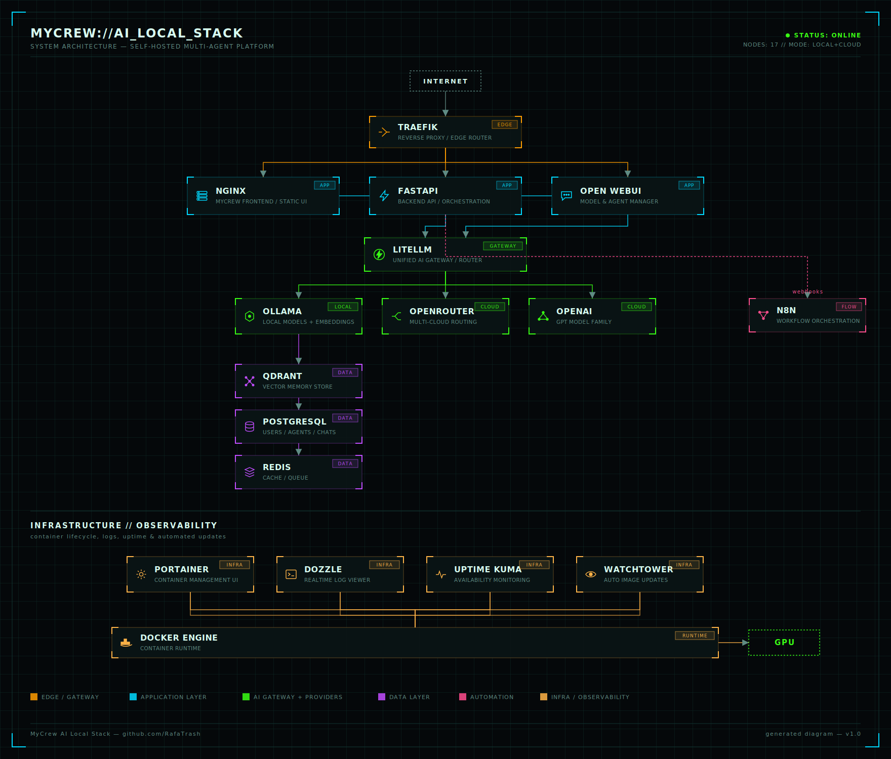

```
╔══════════════════════════════════════════════════════════════════════════════════════╗
║                                                                                      ║
║      ███╗   ███╗██╗   ██╗ ██████╗██████╗ ███████╗██╗    ██╗   v1.0                   ║
║      ████╗ ████║╚██╗ ██╔╝██╔════╝██╔══██╗██╔════╝██║    ██║   AI PLATFORM            ║
║      ██╔████╔██║ ╚████╔╝ ██║     ██████╔╝█████╗  ██║ █╗ ██║   LOCAL • CLOUD          ║
║      ██║╚██╔╝██║  ╚██╔╝  ██║     ██╔══██╗██╔══╝  ██║███╗██║   MULTI AGENT            ║
║      ██║ ╚═╝ ██║   ██║   ╚██████╗██║  ██║███████╗╚███╔███╔╝   SELF HOSTED            ║
║      ╚═╝     ╚═╝   ╚═╝    ╚═════╝╚═╝  ╚═╝╚══════╝ ╚══╝╚══╝    by Rafael Rodrigues    ║
║                                                                                      ║
╚══════════════════════════════════════════════════════════════════════════════════════╝
```


```
                                              INTERNET
                                                  │
                                                  │
                                           ┌───────────────┐
                                           │    TRAEFIK    │
                                           │ Reverse Proxy │
                                           └───────┬───────┘
                                                   │
               ┌───────────────────────────────────┼────────────────────────────────────┐
               │                                   │                                    │
               │                                   │                                    │
      ┌─────────────────┐                 ┌─────────────────┐                 ┌─────────────────┐
      │ MyCrew Frontend │◄───────────────►│ FastAPI Backend │◄───────────────►│   Open WebUI    │
      │      NGINX      │                 │      API        │                 │ Model Manager   │
      └─────────────────┘                 └────────┬────────┘                 └────────┬────────┘
                                                   │                                   │
                                                   │                                   │
                                           ┌───────▼────────┐                          │
                                           │    LiteLLM     │◄─────────────────────────┘
                                           │  AI Gateway    │
                                           └───────┬────────┘
                                                   │
            ┌──────────────────────────────────────┼────────────────────────────────────────────┐
            │                    │                  │                     │                      │
            │                    │                  │                     │                      │
     ┌───────────────┐    ┌──────────────┐   ┌──────────────┐    ┌──────────────┐     ┌──────────────┐
     │    Ollama     │    │ OpenRouter   │   │   OpenAI     │    │  Anthropic   │     │ Gemini/Groq  │
     │ Local Models  │    │ Multi Cloud  │   │ GPT Family   │    │   Claude     │     │ Future APIs  │
     └──────┬────────┘    └──────────────┘   └──────────────┘    └──────────────┘     └──────────────┘
            │
            │
            ▼
      ┌───────────────┐
      │    Qdrant     │
      │ Vector Memory │
      └──────┬────────┘
             │
      ┌──────▼────────┐
      │ PostgreSQL    │
      │ Users         │
      │ Agents        │
      │ Chats         │
      │ Memory        │
      └──────┬────────┘
             │
      ┌──────▼────────┐
      │    Redis      │
      │ Cache / Queue │
      └───────────────┘
```


---

                               Infrastructure / DevOps / Observability

```
             ┌───────────┐    ┌───────────┐    ┌──────────────┐    ┌────────────┐
             │Portainer  │    │  Dozzle   │    │ Uptime Kuma  │    │ Watchtower │
             └─────┬─────┘    └─────┬─────┘    └──────┬───────┘    └─────┬──────┘
                   └────────────┬───┴────────────┬────┴──────────────────┘
                                │                │
                                └──── Docker Engine ──────────────────────────────► GPU
```


<p align="center">
  
</p>

<p align="center">
  
</p>

# MyCrew AI Local Stack


### Core


### Tools


**Responsavel pelo projeto:** Rafael Rodrigues
[](https://github.com/RafaTrash)
[](https://www.linkedin.com/in/rafaelrrodrigues/)

Arquitetura atual: frontend e backend separados.

## Componentes
## Componentes

### Core — essenciais (profile `core`)

Sobem com `docker compose --profile core up -d`. Sem eles o MyCrew nao funciona.

-  `ollama`: inferencia local de modelos e geracao de embeddings.
-  `open-webui`: gestao de modelos e agentes conectados ao Ollama.
-  `qdrant`: banco vetorial usado como memoria/knowledge base dos agentes.
-  `redis`: cache e fila em memoria para o stack.
-  `n8n`: orquestracao dos fluxos de conversa e ingestao de conhecimento.
-  `litellm`: gateway de IA que roteia chamadas entre Ollama e provedores externos (OpenAI, OpenRouter, Gemini, Groq).
-  `postgres`: banco relacional usado pelo LiteLLM (usuarios, chaves, uso de modelos).
-  `python-webapp`: API principal do MyCrew — chat, personas, knowledge e execucao de fluxos n8n.
-  `mycrew-frontend`: interface web para chat, anexar conhecimento e acionar fluxos.

### Tools — opcionais (profile `tools`)

Sobem com `docker compose --profile tools up -d`. Suporte operacional: observabilidade, gestao e automacao — nao sao necessarios para o MyCrew funcionar.

-  `dozzle`: visualizacao de logs dos containers do stack em tempo real.
-  `portainer`: gestao e monitoramento de containers, volumes e redes Docker.
-  `uptime-kuma`: monitoramento de disponibilidade (uptime) dos servicos do stack.
-  `aider`: agente de desenvolvimento para geracao, edicao e revisao de codigo assistida por IA.
-  `watchtower`: atualizacao automatica de imagens Docker e reinicio de containers (atualmente comentado no compose).

> Para subir tudo de uma vez: `docker compose --profile core --profile tools up -d`
> Ou defina `COMPOSE_PROFILES=core,tools` no `.env` e use apenas `docker compose up -d`.

## Pre-requisitos

- Docker + Docker Compose.
- GPU NVIDIA com drivers/`nvidia-container-toolkit` instalados (o servico `ollama` usa `gpus: all`). Sem GPU, remova/ajuste essa diretiva no compose ou espere inferencia mais lenta em CPU.
- **Volumes externos**: alguns volumes sao `external: true` e precisam existir antes do primeiro `up`, senao o Compose falha. Crie antes de subir:

```bash
docker volume create mycrew_ollama_data
docker volume create mycrew_open_webui_data
docker volume create mycrew_qdrant_data
docker volume create mycrew_portainer_data
docker volume create mycrew_uptime_kuma_data
docker volume create mycrew_postgres_data
docker volume create mycrew_litellm_data
docker volume create mycrew_redis_data
```

## Subir ambiente

```bash
docker compose up -d --build
```

## Guia de introducao

### 1. Baixar modelos no Ollama

O container do Ollama sobe vazio — os modelos precisam ser baixados manualmente via `docker exec`:

```bash
# Modelo de chat principal (exemplo)
docker exec -it mycrew-ollama ollama pull llama3.1:8b

# Modelo de codigo, usado pelo Aider (Dev Agent)
docker exec -it mycrew-ollama ollama pull qwen2.5-coder:7b

# Modelo de embeddings, usado na retroalimentacao (Qdrant)
docker exec -it mycrew-ollama ollama pull nomic-embed-text

docker exec -it mycrew-ollama ollama pull qwen2.5-coder:7b


```

Confirme o que ja foi baixado:

```bash
docker exec -it mycrew-ollama ollama list
```

> Troque `llama3.1:8b` por qualquer modelo do [catalogo do Ollama](https://ollama.com/library) compativel com sua GPU/VRAM.

### 2. Acessar o Open WebUI e criar a conta admin

1. Acesse `http://localhost:3001`.
2. **O primeiro cadastro feito vira automaticamente a conta de administrador** — preencha nome, e-mail e senha na tela de registro.
3. Apos logar, confirme em **Settings > Admin Settings > Connections** que o Ollama esta conectado (`http://ollama:11434`, ja vem configurado via `OLLAMA_BASE_URL` no compose).

### 3. Criar o espaco de trabalho (Workspace)

1. No menu lateral, abra **Workspace**.
2. As abas **Models**, **Knowledge**, **Prompts** e **Tools** organizam o que o(s) agente(s) vao usar. Para o MyCrew, o mais importante e a aba **Knowledge** (bases usadas na retroalimentacao via Qdrant) e **Models** (onde os agentes sao definidos).

### 4. Cadastrar um novo modelo/agente

1. Em **Workspace > Models**, clique em **+ Create a Model** (ou **New Model**).
2. Escolha o **modelo base** ja baixado no Ollama (ex: `llama3.1:8b`).
3. De um nome ao agente (ex: `clovis`) e defina o **System Prompt** — e aqui que entra a personalidade/instrucoes do agente.
4. Salve. O agente cadastrado passa a aparecer tanto no seletor de modelos do Open WebUI quanto no endpoint `GET /api/personas` do backend (que lista agentes locais + agentes do OpenWebUI).

### 5. Coletar as API keys para o stack funcionar

O backend (`python-webapp`) precisa de uma chave/token do Open WebUI para autenticar as chamadas (`OPEN_WEBUI_API_KEY` / `OPEN_WEBUI_TOKEN` no `.env`):

1. No Open WebUI, clique no seu avatar (canto superior direito) > **Settings**.
2. Va em **Account** > secao **API Keys**.
3. Clique em **Create new secret key**, copie o valor gerado (ele nao e mostrado novamente).
4. Cole no `.env` do projeto:

```bash
OPEN_WEBUI_API_KEY=sk-...copiado-aqui...
```

5. Reinicie o backend para carregar a nova variavel:

```bash
docker compose restart python-webapp
```

> **n8n**: nao usa API key — a autenticacao e via Basic Auth (`N8N_BASIC_AUTH_USER` / `N8N_BASIC_AUTH_PASSWORD` no `.env`). Os webhooks de fluxo (`N8N_CHAT_FLOW_WEBHOOK`, `N8N_KNOWLEDGE_FLOW_WEBHOOK`) sao copiados de dentro de cada workflow no editor do n8n (node "Webhook" > campo "Production URL").
>
> **Qdrant**: nesta configuracao local nao exige API key por padrao. Se ativar autenticacao (`QDRANT__SERVICE__API_KEY` na imagem oficial), adicione a chave correspondente no `.env` e nas variaveis dos servicos que o consomem (`open-webui`, `python-webapp`).

## URLs

- Frontend MyCrew: `http://localhost:8081`
- Backend API (docs): `http://localhost:8082/docs`
- Open WebUI: `http://localhost:3001`
- Ollama: `http://localhost:11435`
- Qdrant: `http://localhost:6333`
- n8n: `http://localhost:5678`
- Dozzle (logs): `http://localhost:8085/dozzle`
- Portainer (gestao Docker): `http://localhost:9000` (HTTP) ou `https://localhost:9443` (HTTPS)
- Uptime Kuma (monitoramento): `http://localhost:3002`
- Aider (Dev Agent): `http://localhost:8501`
- LiteLLM: `http://localhost:4000`
- PostgreSQL: `http://localhost:5433`

> Nota: o Ollama roda na porta `11435` (nao a padrao `11434`) neste stack — ajustar integracoes/scripts externos de acordo.

## Endpoints principais (backend)

- `GET /api/status`: status de servicos, modelos e agentes OpenWebUI.
- `GET /api/personas`: lista agentes locais + agentes encontrados no OpenWebUI.
- `POST /api/chat`: conversa com recuperacao de contexto do Qdrant.
- `POST /api/knowledge/attach`: anexa conhecimento no Qdrant por agente.
- `GET /api/knowledge/search`: busca conhecimento por agente.
- `POST /api/flows/start`: dispara fluxo no n8n (`chat` ou `knowledge`).
- `GET /api/flows/{flow_id}`: consulta status de execucao do fluxo.
- `GET /api/agent-doc`: retorna arquivo `.md` do agente local.

## Retroalimentacao

A retroalimentacao funciona em dois caminhos:

1. Direto pela API:
- frontend envia conteudo para `POST /api/knowledge/attach`;
- backend quebra em chunks, gera embedding no Ollama;
- backend faz upsert no Qdrant com metadata por agente.

2. Via fluxo n8n:
- frontend aciona `POST /api/flows/start`;
- backend chama webhook do n8n;
- frontend acompanha `GET /api/flows/{flow_id}`.

## Variaveis de ambiente recomendadas

No `.env`, configure:

**Integracao IA / conhecimento**
- `OPEN_WEBUI_API_KEY` ou `OPEN_WEBUI_TOKEN`
- `QDRANT_COLLECTION=mycrew_agent_kb`
- `QDRANT_TOP_K=4`
- `EMBEDDING_MODEL=nomic-embed-text`
- `OLLAMA_REQUEST_TIMEOUT=240`
- `OLLAMA_NUM_PREDICT=512`
- `OLLAMA_KEEP_ALIVE=30m`

**Fluxos n8n**
- `N8N_CHAT_FLOW_WEBHOOK=` URL de webhook para fluxo de conversa
- `N8N_KNOWLEDGE_FLOW_WEBHOOK=` URL de webhook para fluxo de anexos/conhecimento
- `N8N_BASIC_AUTH_USER=admin`
- `N8N_BASIC_AUTH_PASSWORD=` **⚠️ trocar o valor padrao antes de expor o stack ou publicar o repo**

**Aider (Dev Agent)**
- `AIDER_MODEL=qwen2.5-coder:7b` (modelo usado via `ollama_chat/`)
- `AIDER_NUM_CTX=16384` (tamanho de contexto)

**LiteLLM (AI Gateway)**
- `LITELLM_MASTER_KEY=sk-mycrew-litellm-master` (chave master para API)
- `LITELLM_PORT=4000` (porta de acesso)
- `UI_USERNAME=admin-litellm`, `UI_PASSWORD=`: credenciais para UI web
- `OPENAI_API_KEY`, `OPENROUTER_API_KEY`, `GEMINI_API_KEY`, `GROQ_API_KEY`: API keys para provedores externos (opcionais).

**PostgreSQL**
- `POSTGRES_PORT=5433` (porta externa)
- `POSTGRES_USER=litellm`, `POSTGRES_PASSWORD=litellm_password`, `POSTGRES_DB=litellm`: credenciais do banco (usado pelo LiteLLM).

**Portas (todas com defaults no compose, sobrescreva se houver conflito)**
- `MYCREW_FRONTEND_PORT` (8081), `MYCREW_BACKEND_PORT` (8082), `OPEN_WEBUI_PORT` (3001), `OLLAMA_PORT` (11435), `QDRANT_PORT` (6333), `N8N_PORT` (5678), `DOZZLE_PORT` (8085), `PORTAINER_PORT` (9000), `PORTAINER_SSL_PORT` (9443), `KUMA_PORT` (3002), `AIDER_PORT` (8501), `LITELLM_PORT` (4000), `POSTGRES_PORT` (5433)

**Outros**
- `TZ=America/Sao_Paulo`
- `PUBLIC_QDRANT_DASHBOARD`, `PUBLIC_DOZZLE`, `PUBLIC_PORTAINER`, `PUBLIC_UPTIME_KUMA`, `PUBLIC_AIDER`, `PUBLIC_LITELLM`: URLs publicas expostas pelo backend (ja tem defaults calculados a partir das portas acima; sobrescreva se o stack rodar atras de um dominio/proxy reverso).

Sem os webhooks, chat e knowledge direto continuam funcionando; apenas o caminho de fluxo n8n fica indisponivel.

## Observabilidade e gestao do stack

- **Dozzle** (`http://localhost:8085/dozzle`): acompanha logs de todos os containers em tempo real, util para debug rapido sem precisar de `docker logs` manual.
- **Portainer** (`http://localhost:9000`): interface de gestao Docker (containers, imagens, volumes, redes) — util para reiniciar/atualizar servicos sem linha de comando.
- **Uptime Kuma** (`http://localhost:3002`): monitor de disponibilidade dos servicos do stack (Open WebUI, n8n, backend, etc.), com alertas configuraveis.
- **Watchtower**: atualizacao automatica de imagens Docker e reinicio de containers (configurado comentado no compose — descomente para habilitar).

## LiteLLM (AI Gateway)

- **LiteLLM** (`http://localhost:4000`): AI Gateway para roteamento unificado de modelos locais (Ollama) e provedores externos (OpenAI, OpenRouter, Anthropic, Gemini, Groq).
- A UI web permite configurar chaves de API de provedores e gerenciar modelos.
- O banco PostgreSQL persiste configuracoes e metadata dos modelos.

## Dev Agent (Aider)

- **Aider** (`http://localhost:8501`): agente de desenvolvimento assistido por IA, usado para gerar, editar e revisar codigo do proprio stack de forma conversacional. Roda com o modelo local via Ollama (`AIDER_MODEL`, default `qwen2.5-coder:7b`).
- **Escopo padrao**: o container ja inicia restrito a editar apenas `frontend/index.html` e `frontend/app.js` (definido no `command` do servico). Para liberar outros arquivos/pastas, edite a lista de argumentos do servico `aider` no `docker-compose.yml`.
- Auto-commits estao desativados (`--no-auto-commits`) e as mudancas sao sempre aplicadas sem confirmacao manual (`--yes-always`) — revise o diff antes de commitar.
- Recomenda-se restringir o acesso a essa porta ao ambiente local/dev, ja que o agente pode alterar arquivos do projeto.

## Compatibilidade com workflows existentes

Os fluxos em `automation/n8n/workflows/` continuam validos, principalmente para `clovis`.

Se um node no n8n apontar para `http://python-webapp:80`, permanece compativel.

## Licenca

Codigo proprio (`backend/`, `frontend/`, `agents/`, workflows) sob **MIT** — veja [`LICENSE`](./LICENSE).

As imagens de terceiros orquestradas pelo `docker-compose.yml` (n8n, Qdrant, Ollama, Aider etc.) mantem suas proprias licencas — veja [`NOTICE.md`](./NOTICE.md) para detalhes e atencao especial ao n8n (fair-code, nao permissiva para uso comercial como SaaS de terceiros).

## Manutencao

Projeto mantido por **Rafael Rodrigues** ([@RafaTrash](https://github.com/RafaTrash)). Duvidas, sugestoes ou issues: abra uma issue no repositorio ou entre em contato via [LinkedIn](https://www.linkedin.com/in/rafaelrrodrigues/).